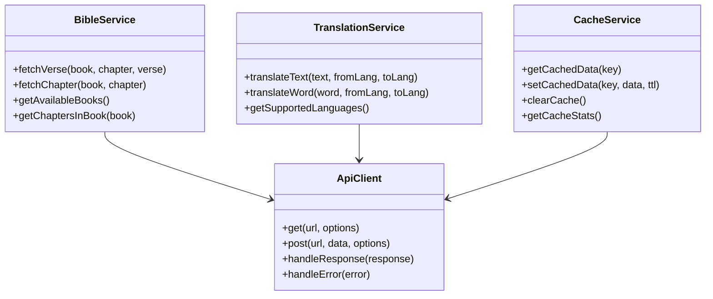

# API Integration Layer Design

## API Service Architecture



## Bible API Integration

### Bible API Endpoints
- **Base URL**: `https://bible-api.com/`
- **Spanish Version**: Reina-Valera (RVR60)

### API Methods

```typescript
// BibleService.ts
class BibleService {
  private apiUrl = 'https://bible-api.com';
  private cache: CacheService;

  constructor(cache: CacheService) {
    this.cache = cache;
  }

  async fetchVerse(book: string, chapter: number, verse: number): Promise<BibleVerse> {
    const cacheKey = `verse-${book}-${chapter}-${verse}`;
    const cached = this.cache.getCachedData(cacheKey);
    if (cached) return cached;

    try {
      const response = await fetch(`${this.apiUrl}/${book}+${chapter}:${verse}?translation=rvr60`);
      if (!response.ok) throw new Error(`HTTP error! status: ${response.status}`);

      const data = await response.json();
      this.cache.setCachedData(cacheKey, data, 86400); // Cache for 24 hours
      return data;
    } catch (error) {
      console.error('Error fetching verse:', error);
      throw error;
    }
  }

  async fetchChapter(book: string, chapter: number): Promise<BibleChapter> {
    const cacheKey = `chapter-${book}-${chapter}`;
    const cached = this.cache.getCachedData(cacheKey);
    if (cached) return cached;

    try {
      const response = await fetch(`${this.apiUrl}/${book}+${chapter}?translation=rvr60`);
      if (!response.ok) throw new Error(`HTTP error! status: ${response.status}`);

      const data = await response.json();
      this.cache.setCachedData(cacheKey, data, 86400); // Cache for 24 hours
      return data;
    } catch (error) {
      console.error('Error fetching chapter:', error);
      throw error;
    }
  }
}
```

## Translation Service

### Mock Translation Implementation

```typescript
// TranslationService.ts
class TranslationService {
  private mockTranslations: Record<string, string> = {
    'principio': 'beginning',
    'cielos': 'heavens',
    'tierra': 'earth',
    'Dios': 'God',
    'creó': 'created',
    // Add more common words as needed
  };

  private cache: CacheService;

  constructor(cache: CacheService) {
    this.cache = cache;
  }

  async translateText(text: string, fromLang: string = 'es', toLang: string = 'en'): Promise<string> {
    const cacheKey = `translation-${text}-${fromLang}-${toLang}`;
    const cached = this.cache.getCachedData(cacheKey);
    if (cached) return cached;

    // Simple mock translation - replace with real API later
    const translated = text.split(' ').map(word => {
      const cleanWord = word.toLowerCase().replace(/[.,\/#!$%\^&\*;:{}=\-_`~()]/g, '');
      return this.mockTranslations[cleanWord] || word;
    }).join(' ');

    this.cache.setCachedData(cacheKey, translated, 3600); // Cache for 1 hour
    return translated;
  }

  async translateWord(word: string, fromLang: string = 'es', toLang: string = 'en'): Promise<string> {
    const cacheKey = `word-translation-${word}-${fromLang}-${toLang}`;
    const cached = this.cache.getCachedData(cacheKey);
    if (cached) return cached;

    const cleanWord = word.toLowerCase().replace(/[.,\/#!$%\^&\*;:{}=\-_`~()]/g, '');
    const translation = this.mockTranslations[cleanWord] || word;

    this.cache.setCachedData(cacheKey, translation, 3600); // Cache for 1 hour
    return translation;
  }
}
```

## Cache Service Implementation

```typescript
// CacheService.ts
class CacheService {
  private cache: Map<string, { data: any, expires: number }> = new Map();

  getCachedData(key: string): any | null {
    const cached = this.cache.get(key);
    if (!cached) return null;

    if (cached.expires < Date.now()) {
      this.cache.delete(key);
      return null;
    }

    return cached.data;
  }

  setCachedData(key: string, data: any, ttl: number): void {
    const expires = Date.now() + (ttl * 1000);
    this.cache.set(key, { data, expires });
  }

  clearCache(): void {
    this.cache.clear();
  }

  getCacheStats(): { size: number, keys: string[] } {
    return {
      size: this.cache.size,
      keys: Array.from(this.cache.keys())
    };
  }
}
```

## Error Handling Strategy

```typescript
// ApiError.ts
class ApiError extends Error {
  constructor(message: string, public statusCode?: number, public originalError?: Error) {
    super(message);
    this.name = 'ApiError';
  }
}

// Error handling middleware
async function withErrorHandling<T>(fn: () => Promise<T>): Promise<[T | null, ApiError | null]> {
  try {
    const result = await fn();
    return [result, null];
  } catch (error) {
    let apiError: ApiError;

    if (error instanceof ApiError) {
      apiError = error;
    } else if (error instanceof Error) {
      apiError = new ApiError(error.message, error.name === 'TypeError' ? 400 : 500, error);
    } else {
      apiError = new ApiError('Unknown error occurred', 500);
    }

    return [null, apiError];
  }
}
```

## API Response Types

```typescript
// types.ts
interface BibleVerse {
  reference: string;
  text: string;
  translation: string;
  verse: number;
  chapter: number;
  book: string;
}

interface BibleChapter {
  reference: string;
  verses: BibleVerse[];
  chapter: number;
  book: string;
  translation: string;
}

interface TranslationResult {
  originalText: string;
  translatedText: string;
  fromLanguage: string;
  toLanguage: string;
  timestamp: string;
}
```

## Rate Limiting & Retry Logic

```typescript
// ApiClient.ts
class ApiClient {
  private retryDelay = 1000; // 1 second
  private maxRetries = 3;

  async getWithRetry(url: string, options: RequestInit = {}, retries = 0): Promise<Response> {
    try {
      const response = await fetch(url, {
        ...options,
        headers: {
          'Accept': 'application/json',
          'Content-Type': 'application/json',
          ...options.headers
        }
      });

      if (!response.ok) {
        if (response.status === 429 && retries < this.maxRetries) {
          await new Promise(resolve => setTimeout(resolve, this.retryDelay * (retries + 1)));
          return this.getWithRetry(url, options, retries + 1);
        }
        throw new ApiError(`HTTP error! status: ${response.status}`, response.status);
      }

      return response;
    } catch (error) {
      if (retries < this.maxRetries) {
        await new Promise(resolve => setTimeout(resolve, this.retryDelay * (retries + 1)));
        return this.getWithRetry(url, options, retries + 1);
      }
      throw new ApiError('Network request failed after retries', 500, error as Error);
    }
  }
}
```

## Integration with Next.js

```typescript
// lib/api.ts - Main API integration file
import { BibleService } from './services/BibleService';
import { TranslationService } from './services/TranslationService';
import { CacheService } from './services/CacheService';

// Singleton pattern for API services
const cacheService = new CacheService();
const bibleService = new BibleService(cacheService);
const translationService = new TranslationService(cacheService);

export {
  bibleService,
  translationService,
  cacheService
};
```

## Future API Enhancements

1. **Real Translation API**: Replace mock service with Google Translate/DeepL
2. **Multiple Bible Versions**: Add version selection
3. **Offline Support**: Implement service workers for caching
4. **Analytics**: Add usage tracking
5. **Authentication**: For premium features