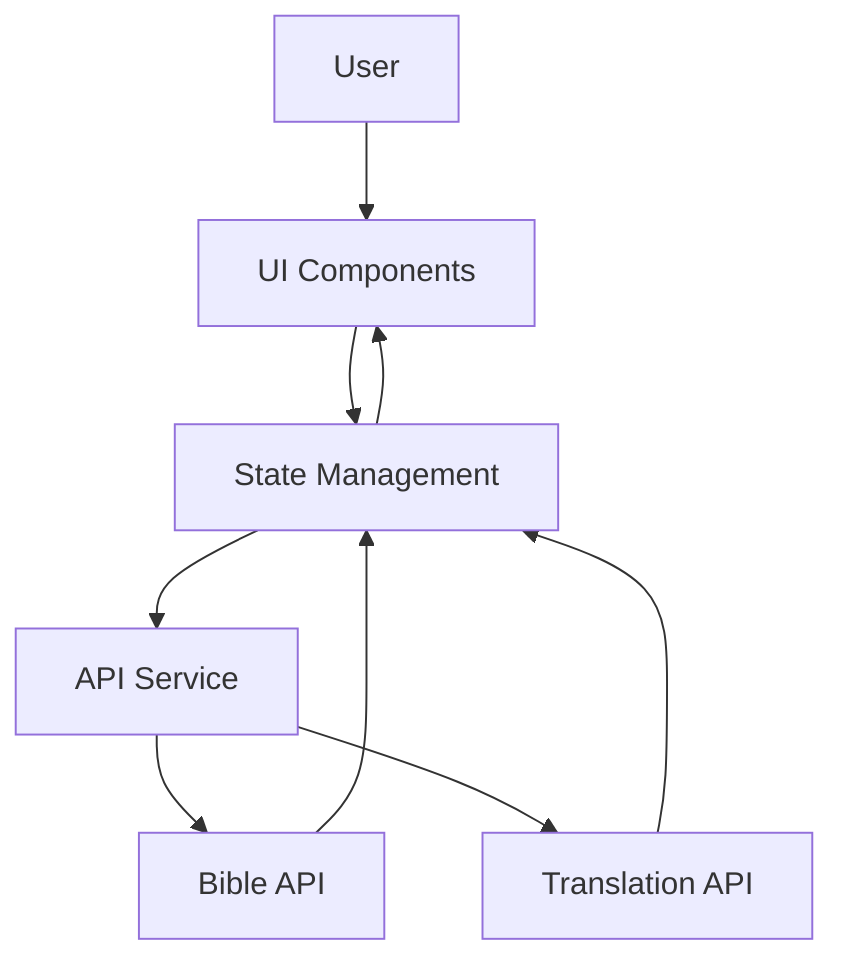

# Bible Reading App with Translation - System Architecture

## Overview
A Next.js web application for reading the Bible in Spanish (Reina-Valera version) with translation capabilities to English for both verses and individual words.

## Selected APIs
- **Bible API**: [Bible API](https://bible-api.com/) - Free API supporting Spanish Reina-Valera version
- **Translation API**: Mock translation service (can be replaced with Google Translate/DeepL later)

## System Architecture

### 1. Component Architecture
```
┌───────────────────────────────────────────────────────┐
│                 User Interface Layer                   │
└───────────────────────────────────────────────────────┘
┌───────────────────────────────────────────────────────┐
│                 Application Layer                      │
└───────────────────────────────────────────────────────┘
┌───────────────────────────────────────────────────────┐
│                 API Integration Layer                  │
└───────────────────────────────────────────────────────┘
┌───────────────────────────────────────────────────────┐
│                 Data & State Management Layer           │
└───────────────────────────────────────────────────────┘
```

### 2. Data Flow



### 3. Core Components

#### UI Components
- **BibleReader**: Main reading interface
- **ChapterNavigator**: Chapter/verse selection
- **TranslationPanel**: Verse translation display
- **WordTranslationTooltip**: Individual word translation
- **SettingsPanel**: User preferences
- **LoadingStates**: Loading indicators
- **ErrorBoundaries**: Error handling

#### API Services
- **BibleService**: Handles Bible API calls
- **TranslationService**: Handles translation requests
- **CacheService**: Manages data caching

#### State Management
- **BibleState**: Current chapter, verse, translation state
- **UIState**: Theme, language preferences
- **CacheState**: Cached Bible verses and translations

### 4. Technical Stack
- **Framework**: Next.js 16 (App Router)
- **UI**: React with TypeScript
- **Styling**: Tailwind CSS with glassmorphic design
- **State Management**: React Context + useReducer
- **API Integration**: Fetch API with caching
- **Translation**: Mock service (replaceable with real API)

### 5. Key Features Implementation

#### Bible Reading
- Fetch chapters/verses from Bible API
- Chapter navigation with dropdowns
- Verse selection interface
- Responsive reading view

#### Translation Features
- **Verse Translation**: Translate entire verse from Spanish to English
- **Word Translation**: Click on individual words for translation
- Translation caching for performance
- Loading states during translation

#### UI Design
- Glassmorphic theme with blur effects
- Dark/light mode support
- Responsive layout for all devices
- Smooth animations and transitions

### 6. Performance Optimization
- **Caching**: Store fetched verses and translations
- **Lazy Loading**: Load components as needed
- **Prefetching**: Preload adjacent chapters
- **Error Handling**: Graceful degradation

### 7. Security Considerations
- API key management (for future translation APIs)
- Rate limiting handling
- Data validation
- Secure storage for user preferences

### 8. Future Enhancements
- Multiple Bible versions
- Bookmarking and notes
- Search functionality
- Audio reading
- Social sharing