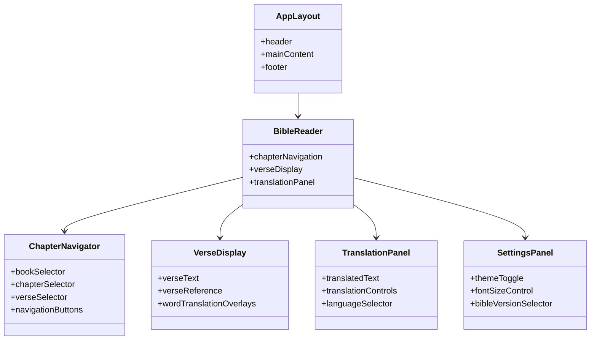

# UI Design & Component Structure

## Glassmorphic Design System

### Color Palette
```css
:root {
  --glass-bg: rgba(255, 255, 255, 0.1);
  --glass-border: rgba(255, 255, 255, 0.2);
  --glass-shadow: 0 8px 32px 0 rgba(0, 0, 0, 0.1);
  --primary: #6366f1;
  --primary-dark: #4f46e5;
  --text-primary: #ffffff;
  --text-secondary: rgba(255, 255, 255, 0.8);
  --blur-value: 10px;
}
```

## Component Structure



## Wireframes

### 1. Main Bible Reader Interface
```
┌───────────────────────────────────────────────────────┐
│  [Book: Génesis ▼] [Chapter: 1 ▼] [Verse: 1 ▼] [◀ ▶]   │
├───────────────────────────────────────────────────────┤
│                                                       │
│  1 En el principio creó Dios los cielos y la tierra.  │
│                                                       │
│  [Translation: In the beginning God created...]      │
│                                                       │
├───────────────────────────────────────────────────────┤
│  [Settings] [Dark Mode] [Font Size] [Share]           │
└───────────────────────────────────────────────────────┘
```

### 2. Word Translation Tooltip
```
┌───────────────────────────────────────────────────────┐
│  En el principio creó Dios los cielos y la tierra.     │
│  ▲                                                  │
│  ┌───────────────────────────────────────────────┐  │
│  │  principio → beginning                           │  │
│  │  [Copy] [Speak] [More Info]                      │  │
│  └───────────────────────────────────────────────┘  │
└───────────────────────────────────────────────────────┘
```

### 3. Mobile Responsive Layout
```
┌───────────────────────────────────────────────────────┐
│  [Génesis 1:1 ▼]                                    │
├───────────────────────────────────────────────────────┤
│  En el principio creó Dios los cielos y la tierra.  │
│  [Translate]                                        │
├───────────────────────────────────────────────────────┤
│  In the beginning God created the heavens and...   │
│  [Copy] [Share]                                     │
└───────────────────────────────────────────────────────┘
```

## Component Hierarchy

```
App
├── Layout
│   ├── Header
│   ├── Main
│   └── Footer
├── BibleReader
│   ├── ChapterNavigator
│   │   ├── BookSelector
│   │   ├── ChapterSelector
│   │   ├── VerseSelector
│   │   └── NavigationControls
│   ├── VerseDisplay
│   │   ├── VerseText
│   │   ├── VerseReference
│   │   └── WordTranslation
│   ├── TranslationPanel
│   │   ├── TranslatedText
│   │   └── TranslationControls
│   └── SettingsPanel
│       ├── ThemeToggle
│       ├── FontControls
│       └── VersionSelector
└── StateProvider
```

## Glassmorphic Component Styles

```jsx
// Glassmorphic Card Component
const GlassCard = ({ children, className = '' }) => (
  <div className={`bg-[var(--glass-bg)] backdrop-blur-[var(--blur-value)]
    border border-[var(--glass-border)] rounded-xl shadow-[var(--glass-shadow)]
    p-6 ${className}`}>
    {children}
  </div>
);

// Glassmorphic Button
const GlassButton = ({ children, onClick, className = '' }) => (
  <button
    onClick={onClick}
    className={`bg-[rgba(255,255,255,0.2)] backdrop-blur-sm
    border border-[rgba(255,255,255,0.3)] rounded-lg px-4 py-2
    hover:bg-[rgba(255,255,255,0.3)] transition-all ${className}`}
  >
    {children}
  </button>
);
```

## Responsive Breakpoints
```css
/* Tailwind breakpoints */
sm: 640px
md: 768px
lg: 1024px
xl: 1280px
```

## Animation System
- Page transitions: fade-in/out (300ms)
- Button interactions: scale (95%) on press
- Loading states: pulse animation
- Tooltip animations: slide-up (200ms)

## Accessibility Features
- Keyboard navigation support
- Screen reader compatibility
- High contrast mode
- Focus indicators
- ARIA labels for interactive elements